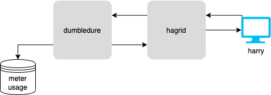

# GRPC Microservice

> A proof of concept project on using grpc in modern microservice architecture

### Design 

There are 4 parts to this project where each is a representation of an actual production service.
 
1. `meterusage.csv` file: This is the datastore. In actual production settings this will be a powerful database.
2. `dumbledore`: it's the grpc-server backend that communicates with the data store and returns the usage data via grpc 
protocol on request from the grpc-client. 
3. `hagrid`: it's the REST API grpc-client service. When it receives an API request for usage data, communicates with
dumbledore via grpc protocol and collects that data and returns JSON data as API response.
4. `harry`: it's a simple html file, that represents a modern single page JavaScript application. It communicates with
the REST API and displays the data. 

#### System Diagram

### Improvements

In actual production setting, things will definitely be a lot more complex. Here are some possible improvements that 
will need to be considered in production:
1. Use a proper database.
2. For grpc communication use streams, as a lot of growing data needs to be transferred.
3. Using caching layer to reduce redundant data transfer.
4. Proper date time formatting.
5. Pagination for performance and better UX.
6. Allow data filtering and ordering.
7. Containerization to make the code more portable.

### Conclusion

gRPC is fast, battle-tested, powerful tool for microservices. In this project it has been demonstrated that how easily 2
services can communicate via gRPC.
